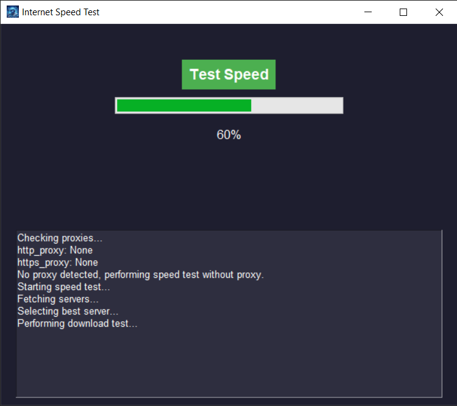

# Internet Speed Test Application

This is a Python-based application that tests your internet speed using the `speedtest` library. It provides both download and upload speeds while updating the user with real-time progress and debugging information. The application is built using `Tkinter` for the user interface, offering a clean and modern design.

## Features

- **Internet Speed Test**: The app measures both download and upload speeds using the `speedtest` library.
- **Progress Bar**: A visual progress bar updates dynamically during the test, showing the percentage of completion.
- **Proxy Support**: If a proxy is detected in the environment, the user can input authentication credentials for it.
- **Debugging Log**: All debugging messages are displayed within the application, offering transparency and insight into the process.
- **Responsive UI**: A modern and simple design for the window, with labels and buttons styled for clarity and ease of use.

## Requirements

Ensure you have the following dependencies installed:

- Python 3.x
- `speedtest-cli` library
- `Tkinter` (usually included with Python)

## Setup

### Step 1: Create a Virtual Environment

Before running the program, it's recommended to set up a virtual environment. Navigate to your project directory and run the following commands:

```bash
# Create a virtual environment
python -m venv venv

# Activate the virtual environment (Windows)
venv\Scripts\activate

# Activate the virtual environment (Linux/Mac)
source venv/bin/activate
```

### Step 2: Install the Dependencies

After activating the virtual environment, install the required dependencies from the `requirements.txt` file:

```bash
pip install -r requirements.txt
```

### Step 3: Run the Application

Once the environment is set up and dependencies are installed, you can run the application:

```bash
python speed_test_app.py
```

## How It Works

### Proxy Detection

If your environment has proxy settings (`http_proxy` or `https_proxy`), the application will prompt you for authentication details such as username, password, proxy IP, and port. It will test the proxy connection before proceeding to the speed test.

### Internet Connection Check

Before initiating the speed test, the application verifies if an active internet connection is available by attempting to reach Google.

### Progress Bar & Debugging Log

The application provides real-time feedback by updating the progress bar as it fetches servers, selects the best one, and performs the download/upload tests. A `Text` widget at the bottom of the window logs debugging messages, ensuring users are kept informed of each step in the process.

## Running the Application

To run the application:

1. Activate your virtual environment (if not already active).
2. Execute the Python script:

```bash
python speed_test_app.py
```

### How to Use

1. Click the `Test Speed` button to start the internet speed test.
2. The application will automatically detect any proxy configuration and prompt for credentials if necessary.
3. A progress bar will update as the test progresses, and the result will be displayed once the test completes.
4. Debugging messages are displayed in the lower section of the application window, offering insights into what the app is doing behind the scenes.

## File Structure

```
.
├── icono.ico                  # (Optional) Icon file for the application window
├── README.md                  # This documentation file
├── requirements.txt           # List of required dependencies
└── speed_test_app.py           # Main application script
```

## Customization

- **Window Icon**: To add your own window icon, replace the `icono.ico` file with your custom `.ico` file and place it in the same directory as the script.
- **Colors and Fonts**: Modify the `create_window()` function in the script to customize the button colors, fonts, and layout to your preferences.

## Error Handling

- **No Internet Connection**: If no internet connection is detected, the app will display a popup informing the user.
- **Proxy Authentication**: If the proxy credentials are incorrect or the proxy connection fails, the app will notify the user with an error message.
- **General Errors**: Any other exceptions that occur during the test (e.g., issues with the `speedtest` servers) will be reported via a popup message.

## Example Screenshots

### Main Screen:


### Test In Progress:


### Speed Test Result:

```

### Notas:
- Asegúrate de crear el archivo `requirements.txt` que contenga las dependencias necesarias, como `speedtest-cli`, y cualquier otra que uses en tu proyecto.
- También puedes incluir imágenes en la sección de "Example Screenshots" para mostrar cómo se ve la aplicación en acción.